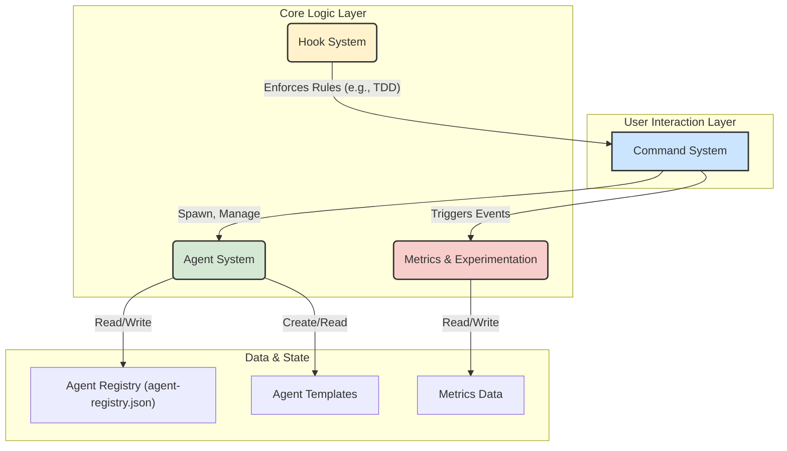

# `claude-tdd-agents` 项目技术解析

## 摘要
本文档对 `claude-tdd-agents` 项目进行全面的技术复盘。本文将从项目的初始目标与核心问题出发，详细阐述为解决这些问题所采用的方案策略与系统架构，并深入剖析其核心功能的实现细节。本文旨在提供一个清晰、结构化的项目技术概览，分享在构建高可靠性 AI Agent 框架过程中的工程实践与技术洞见。

---

## 目录
1.  [**引言**](#1-引言)
    *   [1.1. 背景：AI 辅助开发的预期与挑战](#11-背景ai-辅助开发的预期与挑战)
    *   [1.2. 问题定义：当前 AI 工具的核心局限](#12-问题定义当前-ai-工具的核心局限)
    *   [1.3. 项目目标：构建高规范性的 AI Agent 协同框架](#13-项目目标构建高规范性的-ai-agent-协同框架)
2.  [**核心策略**](#2-核心策略)
    *   [2.1. 核心策略一：强制执行测试驱动开发 (TDD)](#21-核心策略一强制执行测试驱动开发-tdd)
    *   [2.2. 核心策略二：采用“Hub-Spoke”模型进行任务分派](#22-核心策略二采用hub-spoke模型进行任务分派)
    *   [2.3. 核心策略三：通过“测试驱动交接”确保交付质量](#23-核心策略三通过测试驱动交接确保交付质量)
    *   [2.4. 核心策略四：推行“研究驱动编码”模式](#24-核心策略四推行研究驱动编码模式)
3.  [**系统架构设计**](#3-系统架构设计)
    *   [3.1. 整体架构概览](#31-整体架构概览)
    *   [3.2. Agent 系统：动态、可控的 Agent 全生命周期管理](#32-agent-系统动态可控的-agent-全生命周期管理)
    *   [3.3. 命令系统：统一、可扩展的用户交互接口](#33-命令系统统一可扩展的用户交互接口)
    *   [3.4. 度量与实验框架：数据驱动的架构演进](#34-度量与实验框架数据驱动的架构演进)
4.  [**核心能力实现**](#4-核心能力实现)
    *   [4.1. 工作流一：Agent 的创建与注册](#41-工作流一agent-的创建与注册)
    *   [4.2. 工作流二：命令的解析与执行](#42-工作流二命令的解析与执行)
    *   [4.3. TDD Handoff：`test-driven-handoff.sh` 钩子的实现机制](#43-tdd-handofftest-driven-handoffsh-钩子的实现机制)
    *   [4.4. 核心机制：模板的继承与渲染](#44-核心机制模板的继承与渲染)
5.  [**总结与展望**](#5-总结与展望)
    *   [5.1. 项目核心成果](#51-项目核心成果)
    *   [5.2. 未来方向](#52-未来方向)

---

## 1. 引言

### 1.1. 背景：AI 辅助开发的预期与挑战

**预期**：基于大语言模型（LLM）的 AI 辅助开发工具旨在革新软件开发范式。其目标是通过自然语言指令，实现从功能设计、代码编写到测试、部署的全流程自动化，从而提升开发效率，使开发者能专注于更高层次的架构与创新活动。

**挑战**：然而，当前多数 AI 编程助手在实际应用中主要作为代码片段生成器，而非可靠的工程伙伴。其生成物普遍存在上下文理解不足、代码风格不一致的问题，且通常不包含测试用例。这导致最终代码质量不可控，集成的隐性成本和维护难度显著增加。

### 1.2. 问题定义：当前 AI 工具的核心局限

当前 AI Agent 在软件开发协作中，主要表现出以下三类核心局限：

*   **不可靠 (Unreliable)**：AI Agent 在编码时，可能生成不存在的 API 调用或库函数引用，导致代码在编译或运行时失败。同时，其对复杂逻辑的处理能力有限，生成的代码通常仅能覆盖理想路径（Happy Path），而缺乏对边界条件和异常情况的鲁棒处理。
*   **不可控 (Uncontrollable)**：在处理复杂任务时，单一的通用型 Agent 难以保证技术选型的正确性和多任务执行的连贯性。这可能导致最终交付成果缺乏系统性与一致性。
*   **不可预测 (Unpredictable)**：由于缺乏标准化的开发流程约束，AI 的输出结果具有显著的不确定性。两次相同的输入可能产生截然不同的输出，这种不确定性阻碍了将其稳定地整合到工程化开发流程中的可能性。

### 1.3. 项目目标：构建高规范性的 AI Agent 协同框架

为应对上述挑战，`claude-tdd-agents` 项目旨在构建一个高规范性、分工明确、流程标准的 AI Agent 协同框架。

该框架的核心设计思想，是将软件工程的最佳实践（尤其是测试驱动开发 TDD）固化为一套强制性的规则和自动化流程。所有在该框架内运行的 AI Agent 都必须严格遵守这些规范。此框架的目标是将 AI 从一个输出不确定的代码生成工具，转变为一个由多个专业、高效的 Agent 组成的协同系统，从而系统性地提升 AI 辅助开发的可靠性与最终交付质量。

## 2. 核心策略

为实现上述目标，项目确立了四项核心策略，共同构成框架的理论基础。

### 2.1. 核心策略一：强制执行测试驱动开发 (TDD)

测试是保障软件质量的基础。因此，测试驱动开发（TDD）被设定为整个框架的首要开发原则。通过在 Agent 的行为准则和工具链中强制实施 “RED → GREEN → REFACTOR” 的开发循环，框架确保任何功能实现代码的编写都必须以一个明确的、失败的测试（RED）作为前置条件，从根本上杜绝未经测试的代码被合入代码库。

### 2.2. 核心策略二：采用“Hub-Spoke”模型进行任务分派

为解决单一 Agent 无法胜任复杂任务的问题，框架采用了“中心-辐射模型”（Hub-Spoke）。该模型设立一个中心协调者（如 `@task-orchestrator`），负责接收并解析用户原始需求，将其分解为一系列更小、具体的子任务。随后，该协调者根据各子任务的性质，将其分派给最合适的“专家型”子代理（Spoke）执行。此模式确保了任务处理的专业化与有序性。

### 2.3. 核心策略三：通过“测试驱动交接”确保交付质量

在“Hub-Spoke”模型中，不同 Agent 之间的工作交接点是潜在的质量风险点。为确保信息和产出的准确传递，框架引入了“测试驱动交接”（Test-Driven Handoffs）机制。该机制要求，一个 Agent 的输出必须通过下游 Agent 预先定义的验收测试，才能被确认为“交付成功”。这种基于测试的协作方式，保障了整个工作流的健壮性。

### 2.4. 核心策略四：推行“研究驱动编码”模式

为了解决 AI 生成不存在 API 的问题，框架限制 Agent 直接依赖其内部知识进行编码。在执行具体编码任务前，Agent 被强制要求首先使用集成的研究工具（如 `Context7`），查询和学习相关的官方文档或现有代码库。这种“先研究，后编码”的模式，确保了所有代码实现均基于准确、真实的 API 知识，从而从源头提高代码的可靠性。

## 3. 系统架构设计

为了支撑上述策略，我们设计了一套模块化、可扩展的系统架构。该架构将 Agent 生命周期管理、用户命令交互、以及系统度量与验证进行解耦，以实现高度的灵活性和可维护性。

### 3.1. 整体架构概览

项目整体由四大核心模块协作构成：

*   **命令系统 (Command System)**：作为用户与框架交互的统一入口，负责解析用户指令并将其分派到对应的处理模块。
*   **Agent 系统 (Agent System)**：框架的核心，负责所有 Agent 的创建、注册、管理和销毁的全生命周期。
*   **钩子系统 (Hook System)**：工程实践的强制执行机制。它在命令执行的关键节点（如 `PreToolUse`）触发，用以强制执行 TDD 验证等核心规则。
*   **度量与实验框架 (Metrics & Experimentation)**：负责收集数据、运行 A/B 测试，以科学的方法验证架构假设，驱动项目演进。

### 3.2. Agent 系统：动态、可控的 Agent 全生命周期管理

Agent 系统是整个框架的核心，它确保了对大量 Agent 的动态和可控管理。

#### 3.2.1. `AgentRegistry`：唯一的真实之源

[`AgentRegistry.js`](lib/AgentRegistry.js:1) 是 Agent 信息的“单一事实来源”（Single Source of Truth）。它维护一个持久化的注册表（存储于 `/.claude/state/agent-registry.json`），记录每个 Agent 的 ID、状态、模板来源等关键元数据。通过提供统一的查询和更新接口，它保证了系统内所有模块对 Agent 信息的一致性认知。

#### 3.2.2. `AgentSpawner` & `AgentTemplateSystem`：Agent 的工厂与蓝图

[`AgentSpawner.js`](lib/AgentSpawner.js:1) 扮演“Agent 工厂”的角色，而 [`AgentTemplateSystem.js`](lib/AgentTemplateSystem.js:1) 则是“蓝图库”。创建新 Agent 的流程如下：
1.  `AgentSpawner` 从模板库（`templates/agents/`）中选取一个合适的蓝图（如 `research-agent.md`）。
2.  `AgentTemplateSystem` 利用 Handlebars.js 模板引擎，将用户传入的参数与模板配置合并，动态渲染出最终的 Agent 定义文件。
3.  该系统支持模板继承，允许定义一个 `base` 模板，其他模板可继承并扩展它，从而提高 Agent 定义的可复用性。

#### 3.2.3. `AgentLifecycleManager`：自动化治理与回收

[`AgentLifecycleManager.js`](lib/AgentLifecycleManager.js:1) 负责 Agent 的自动化治理。它作为一个后台守护进程，定期轮询 `AgentRegistry`，并根据预设策略（如：最长空闲时间、最大任务数）来自动清理和回收不活跃或冗余的 Agent。这套自动化治理机制确保了系统资源的有效利用。

### 3.3. 命令系统：统一、可扩展的用户交互接口

框架提供了一个以 `/` 开头的命令行交互界面，由 [`CommandSystem.js`](lib/command-system.js:1) 和 [`CollectiveCommandParser.js`](lib/command-parser.js:1) 驱动。

#### 3.3.1. 命令解析与分派机制

该系统采用了外观（Facade）与解释器（Interpreter）模式：
*   **`CommandSystem` (外观)**：提供统一的 `executeCommand(input)` 入口，封装了历史记录、自动补全、命令解析等内部子系统。
*   **`CommandParser` (解释器)**：作为命令系统的核心解析引擎，它维护一个命令注册表，通过正则表达式解析用户输入，提取出 `namespace`、`command` 和 `args`，然后分派给已注册的对应处理函数。这种设计使得新命令的扩展只需注册一个新的处理函数即可。

### 3.4. 度量与实验框架：数据驱动的架构演进

此模块是本项目区别于其他 AI 框架的特点之一，旨在通过量化数据证明架构决策的有效性。

#### 3.4.1. 核心假设与 A/B 测试框架

框架定义了三个需被验证的核心架构假设：**JIT 加载的效率**、**Hub-Spoke 协调的有效性**和**TDD 交接的可靠性**。为验证这些假设，系统构建了一个 A/B 测试与随机对照试验（RCT）框架 ([`ExperimentFramework.js`](lib/metrics/ExperimentFramework.js:1))。该框架能够：
1.  将用户流量通过确定性哈希算法，随机且均匀地分配到“对照组”（旧方案）和“实验组”（新方案）。
2.  通过专门的度量收集器（如 [`JITLoadingMetrics.js`](lib/metrics/JITLoadingMetrics.js:1)）捕获两组用户的关键行为数据。
3.  进行统计学分析，为评估新方案是否显著优于旧方案提供量化依据。

## 4. 核心能力实现

本章节通过分析核心工作流的代码实现，展示上述设计理念的具体落地。

### 4.1. 工作流一：Agent 的创建与注册

此过程是一个职责清晰的调用链：

1.  **用户输入**: 用户在终端输入 `/agent spawn --template=research --name=MyResearcher`。
2.  **命令解析**: [`CommandParser`](lib/command-parser.js) 捕获输入，将其解析为对 `AgentSpawnCommand` 模块的调用，并传递参数 `{ template: 'research', name: 'MyResearcher' }`。
3.  **模板渲染**: [`AgentSpawnCommand`](lib/AgentSpawnCommand.js) 调用 [`AgentSpawner.spawn()`](lib/AgentSpawner.js:77)。`Spawner` 请求 [`AgentTemplateSystem`](lib/AgentTemplateSystem.js) 使用 `research` 模板和用户参数，渲染出最终的 Agent 定义文件。
4.  **写入磁盘**: `AgentSpawner` 将渲染内容写入 `/.claude/agents/MyResearcher.md` 文件。
5.  **完成注册**: `AgentSpawnCommand` 调用 [`AgentRegistry.register()`](lib/AgentRegistry.js:98)，将新 Agent 的元数据写入 `agent-registry.json`，并发布一个 `agent-registered` 事件。

### 4.2. 工作流二：命令的解析与执行

1.  **统一入口**: 所有命令的执行始于对 [`CommandSystem.executeCommand(input)`](lib/command-system.js:50) 的调用。
2.  **解析与分派**: `CommandSystem` 将输入委托给 [`CommandParser.parse()`](lib/command-parser.js:95)。该方法利用正则表达式进行匹配，将命令分解为 `namespace`、`command` 和 `args`，并在内部的 `commands` 映射中查找对应的处理函数。
3.  **钩子触发**: 在调用处理函数之前，`CommandSystem` 会执行所有已注册的 `PreCommand` 钩子。这是一个关键的设计点，允许在此处注入 TDD 验证等强制性规则检查。
4.  **执行与委派**: 查找到的处理函数被执行。对于复杂命令（如 `/agent spawn`），它会将任务进一步委派给更专业的模块（如 `AgentSpawnCommand`）处理。
5.  **收尾工作**: 命令执行完毕后，`CommandSystem` 负责记录命令历史、更新性能度量，并最终返回执行结果。

### 4.3. TDD Handoff：`test-driven-handoff.sh` 钩子的实现机制

TDD 的强制执行主要通过 `/.claude/hooks/test-driven-handoff.sh` 钩子脚本实现。

1.  **钩子注册**: 框架初始化时，该脚本被注册为 `PreToolUse` 事件的监听器。
2.  **事件触发**: 当 Agent 尝试使用工具（如 `edit_file`）时，`PreToolUse` 事件被触发。
3.  **钩子执行**: `test-driven-handoff.sh` 脚本被激活，并执行以下检查：
    *   检查当前工作区是否存在一个或多个失败的测试。它会运行测试套件（如 `npm test`），并分析测试结果。如果所有测试均通过或没有测试存在，脚本返回一个非零退出码。
4.  **执行中断**: `CommandSystem` 捕获到非零退出码，将其解释为“前置条件检查失败”。因此，它会中断即将执行的工具调用，并向用户报告 TDD 交接失败的错误。
5.  **强制循环**: 此机制强制开发流程必须遵循 TDD 循环：先创建一个导致测试失败的场景（RED），然后才能获得修改或编写应用代码的权限（GREEN）。

### 4.4. 核心机制：模板的继承与渲染

[`AgentTemplateSystem`](lib/AgentTemplateSystem.js) 的动态能力主要源于以下两个核心方法：

1.  **`getResolvedTemplate(templateName)`**: 当请求一个模板时，此方法首先加载其定义文件。若文件包含 `parent` 属性（如 `parent: 'base'`），它将递归调用自身以加载父模板。
2.  **`mergeTemplates(child, parent)`**: 在递归返回过程中，该方法会深度合并子模板与父模板的配置。数组属性会被拼接，而对象和基础类型属性则由子模板覆盖父模板。
3.  **最终渲染**: 经过层层合并，形成一个完整的模板对象。最后，`createAgent()` 方法将此最终对象作为上下文数据，注入 Handlebars.js 模板引擎，生成最终的 Agent 定义文件。

## 5. 总结与展望

### 5.1. 项目核心成果

`claude-tdd-agents` 项目成功构建了一个高度结构化、流程严谨的 AI 辅助开发框架。通过将 TDD 确立为核心原则，并结合 Hub-Spoke 调度、测试驱动交接、研究驱动编码等策略，有效应对了当前 AI 编程工具在可靠性、可控性和可预测性方面的核心局限。该项目的产出不仅是一个工具集，更是一套将软件工程最佳实践注入 AI 开发流程的操作系统。

### 5.2. 未来方向

本项目未来的发展方向包括：

*   **智能化 Agent 治理**: 当前的 `AgentLifecycleManager` 基于简单策略进行管理。未来可引入机器学习模型，根据 Agent 的历史表现、任务成功率等更多维度，进行更智能的预测性回收与资源伸缩。
*   **可视化工作流编辑器**: 将当前的命令行操作升级为可视化的拖拽式工作流编辑器，使用户能更直观地编排和监控由多个 Agent 组成的复杂任务流。
*   **生态系统与社区建设**: 开放并标准化 Agent 模板和钩子脚本的开发，鼓励社区贡献更多垂直领域的“专家 Agent”和“规则插件”，逐步构建一个丰富的 Agent 生态。