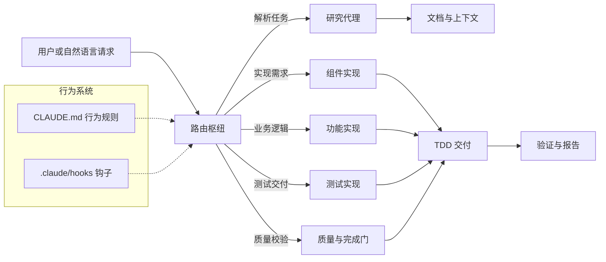
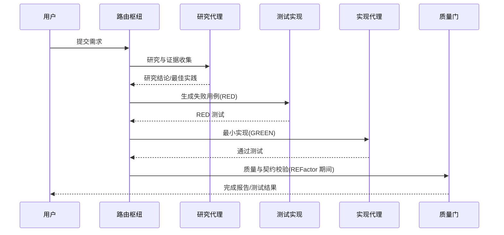
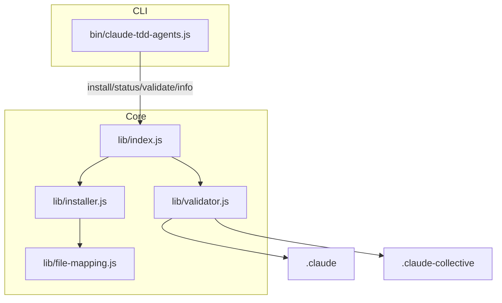
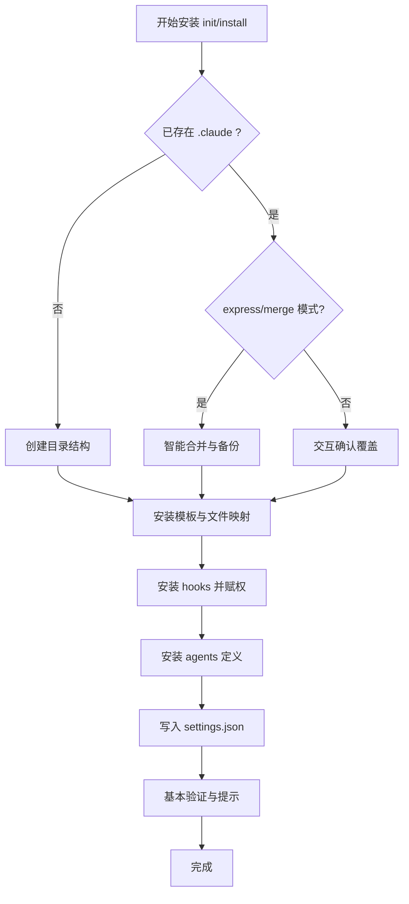
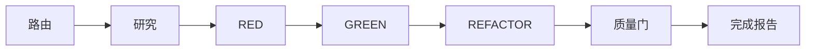
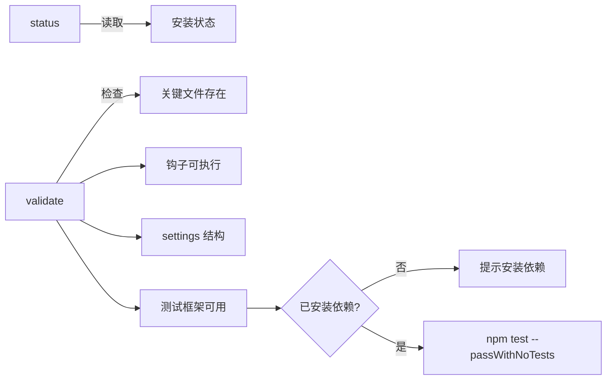
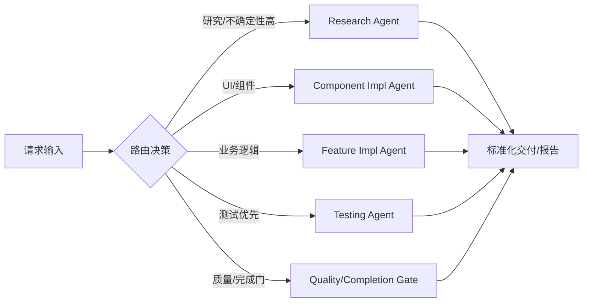

# claude tdd agents（中文文档）

> 实验性 NPX 安装器与子代理（Sub-Agent）协作框架：以 TDD 驱动、Hub-Spoke 路由协调、契约化交接与可验证交付为核心，助力快速原型与高质量实现。

- 项目名称：`claude-tdd-agents`
- 运行环境：Node.js >= 20
- 主要能力：TDD 校验、Hub-Spoke 协调、行为系统（CLAUDE.md）、钩子与命令体系、研究与指标收集、动态 Agent 生成
- 安装方式（推荐）：
```bash
npx claude-tdd-agents init
```

---

## 一、框架总览与运行机制

### 1. 架构模型：Hub-Spoke + 行为操作系统
- **Hub（路由枢纽）**：请求统一进入路由/编排层（如 `@task-orchestrator` 或 `routing-agent`），根据任务类型路由到合适的专业化 Sub-Agent。
- **Spoke（专业代理）**：如组件实现、功能实现、测试实现、质量校验、研究分析、DevOps 等，按职责单一执行，并产出契约化交付。
- **Behavioral OS（行为操作系统）**：`CLAUDE.md` 定义了全局行为规则（如“先测试后实现”“统一通过路由”“质量门校验”），钩子脚本在工具使用的关键阶段强制执行这些规则。



### 2. TDD 驱动的交付流程
1) 路由阶段：入口命令（如 `/van` 或 CLI）将请求送至路由枢纽。
2) 研究阶段：子代理调用研究能力（如 Context7），检索真实文档与最佳实践。
3) RED：先生成失败的测试（定义期望）。
4) GREEN：最小实现以满足测试通过。
5) REFACTOR：在测试保护下进行必要重构。
6) 完成回报：输出标准化 TDD 完成报告与测试结论。



### 3. 关键目录与产物（安装后）
```
your-project/
├── CLAUDE.md                   # 行为系统定义（Prime Directives）
├── .claude/
│   ├── settings.json           # 钩子/阶段配置
│   ├── agents/                 # 30+ 子代理定义（*.md/*.json）
│   └── hooks/                  # 强制 TDD/路由/指标收集等脚本
└── .claude-collective/
    ├── tests/                  # 测试与契约用例骨架
    ├── jest.config.js          # 测试配置（可能包含）
    └── package.json            # 测试运行所需依赖与脚本
```

### 4. CLI 与核心模块
- 可执行入口：`bin/claude-tdd-agents.js`
  - `init|install`：安装框架（交互/快速模式）
  - `status`：检测安装状态
  - `validate`：校验安装完整性（支持 `--detailed`）
  - `info`：打印框架元信息
- 核心类：`lib/index.js` 暴露 `ClaudeCodeCollective`，封装 `install/validate/getInfo`
- 安装器：`lib/installer.js` 负责创建目录、拷贝模板、安装钩子与代理、验证落地
- 校验器：`lib/validator.js` 校验关键文件、钩子可执行性、设置结构与测试框架
- 文件映射：`lib/file-mapping.js` 定义模板到目标路径的安装映射与过滤策略



---

## 二、安装与配置

### 1. 安装命令
```bash
# 快速体验（推荐）
npx claude-tdd-agents init

# 其它模式
npx claude-tdd-agents init --minimal      # 核心轻量安装
npx claude-tdd-agents init --interactive  # 强制交互
npx claude-tdd-agents init --yes          # 快速/无人值守
npx claude-tdd-agents init --force        # 冲突强制覆盖（会备份）
```

### 2. 安装过程要点（来源：installer.js）
- 检测已有安装并根据选项选择：交互覆盖或智能合并（express 模式）。
- 创建目录：`.claude/agents|hooks|commands`、`.claude-collective/tests|metrics`、`.taskmaster` 等。
- 拷贝模板：按 `file-mapping` 将模板文件处理占位符后写入目标（必要文件可覆盖或智能跳过）。
- 设置钩子：模板中的 shell 脚本写入 `.claude/hooks/` 并赋予可执行权限。
- 安装代理：代理定义（md/json）写入 `.claude/agents/`。
- 基本验证：关键文件/目录存在性检查。



### 3. 配置文件
- `.claude/settings.json`：钩子阶段与执行清单（`hooks.PreToolUse/PostToolUse/SubagentStop` 等必须存在）。
- `CLAUDE.md`：行为系统（如“禁止直接实现，必须经由路由”“TDD 验证必须通过”）。
- `.claude-collective/package.json` 与 `jest.config.js`：测试框架依赖与脚本。

### 4. 版本与运行要求
- Node.js >= 20
- 首次安装后建议重启编辑器/代理运行环境，以确保钩子生效。

---

## 三、使用方法

### 1. CLI 命令
```bash
# 安装
npx claude-tdd-agents init

# 查看状态
npx claude-tdd-agents status

# 校验（含详细输出）
npx claude-tdd-agents validate --detailed

# 查看信息
npx claude-tdd-agents info
```

### 2. 典型使用流程
1) 在现有项目内执行安装命令；
2) 重启你的 Agent/IDE 以加载钩子；
3) 发起自然语言请求（如“实现一个 React Todo 组件并含测试”）；
4) 系统路由到合适的 Sub-Agent，先生成测试，再交付实现并运行校验；
5) 查看 `.claude-collective/tests` 与完成报告，按需继续迭代。



### 3. 状态与验证
- `status` 输出：是否已安装、行为系统/测试/钩子状态、已安装代理数量、版本等。
- `validate`：
  - 文件存在性：`CLAUDE.md`、`.claude/settings.json`、hooks/agents/tests 目录、测试配置等；
  - 钩子可执行性：`directive-enforcer.sh`、`collective-metrics.sh`、`test-driven-handoff.sh`、`routing-executor.sh`；
  - 设置结构校验：`hooks.PreToolUse/PostToolUse/SubagentStop` 为数组；
  - 测试框架：`.claude-collective/package.json` 是否含 Jest 依赖与 `scripts.test`；如依赖未安装则提醒；若已安装，会尝试 `npm test -- --passWithNoTests` 并给出结果或警告。



---

## 四、子代理（Agents）与路由

### 1. 常见子代理类别
- 实现类：组件实现、功能实现、基础设施实现、测试实现、打磨优化等。
- 质量与验证：质量审查、功能验证、质量门、完成门。
- 研究与智能：研究代理、PRD 解析/研究、任务编排器。
- 系统与协调：`/van` 维护、行为转换、钩子集成、路由/任务编排、指标收集。

实际可用代理以 `.claude/agents/` 为准（安装模式不同会有差异，`--minimal` 至少包含 `routing-agent.md`）。

### 2. 路由原则
- 所有需求经由路由枢纽识别任务类型与复杂度，选择合适子代理；
- 若涉及外部依赖或不确定 API，先进入研究阶段，基于真实文档决策；
- 全程受 `CLAUDE.md` 与钩子强制约束，确保 TDD 与质量门执行。



---

## 五、最佳实践

- 统一入口：任何实现请求先通过路由（不要绕过 `CLAUDE.md` 与 hooks）。
- 先测试后实现：保持 RED→GREEN→REFACTOR 节奏，避免过度实现。
- 小步提交：每次交付应伴随可运行测试与验证结果，便于回归。
- 配置最小化变更：自定义 `.claude/settings.json` 时，只修改必要字段，保留必需的 Hook 阶段结构。
- 谨慎覆盖：再次安装时优先使用智能合并或最小化安装；启用 `--force` 前做好备份（安装器会尽量自动备份）。
- 性能/稳定性：研究阶段可能较慢，必要时先本地缓存依赖与文档；出现异常先运行 `validate` 并查看 `.claude-collective/metrics`。
- 团队协作：将 `.claude/` 与 `.claude-collective/` 纳入仓库（按需筛选 node_modules），确保一致的行为系统与测试骨架。

---

## 六、常见问题（FAQ）

- 安装失败：
  - 确认 Node.js 版本（>=16），清理 npm 缓存：`npm cache clean --force`；
  - 尝试：`npx claude-tdd-agents init --force`；
  - 查看 CLI 错误与栈（加 `--verbose`）。
- 钩子不生效：
  - 确保 `.claude/hooks/*.sh` 具有执行权限（安装器会设置为 755）；
  - 某些运行环境需重启以重新加载；
  - 运行 `npx claude-tdd-agents status` 与 `validate --detailed` 查看详情。
- 测试无法运行：
  - 检查 `.claude-collective/package.json` 是否包含 Jest 依赖与 `scripts.test`；
  - 进入 `.claude-collective/` 执行 `npm install` 后再试。
- 研究阶段慢：
  - 可能为外部依赖或文档源网络问题；
  - 先本地验证最小可行用例，或跳过非关键研究再回补。

---

## 七、开发者参考

- 源码入口：`lib/index.js`
- CLI：`bin/claude-tdd-agents.js`
- 安装器：`lib/installer.js`（创建目录、模板安装、钩子权限、代理安装、TaskMaster 预配置与校验）
- 校验器：`lib/validator.js`（存在性、可执行性、配置结构、测试框架与简单试跑）
- 模板映射：`lib/file-mapping.js`（必需文件、最小安装过滤、占位符替换）

---

## 八、许可证

- 本项目以 MIT 许可证发布，详见仓库 `LICENSE`。

---

## 九、快速参考

```bash
# 安装（交互或快速）
npx claude-tdd-agents init
npx claude-tdd-agents init --yes --minimal

# 状态/校验/信息
npx claude-tdd-agents status
npx claude-tdd-agents validate --detailed
npx claude-tdd-agents info
```
