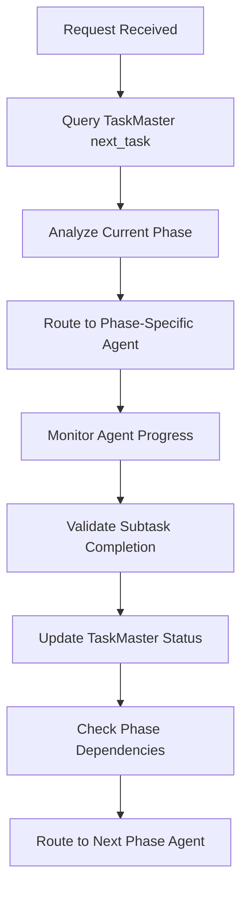

# Hub-and-Spoke Coordination Guide

## Overview

This guide provides the @routing-agent (hub) with comprehensive instructions for coordinating the claude-tdd-agents enhancement project using TaskMaster integration.

## Architecture Pattern

```
                    @routing-agent (HUB)
                           |
    ┌──────────────────────┼──────────────────────┐
    |                      |                      |
behavioral-        enhanced-project-        specialized-
transformation     manager-agent           implementation
agent                     |                    agents
    |                     |                      |
    └─────────────────────┼──────────────────────┘
                          |
                   TaskMaster MCP
                 (Single Source of Truth)
```

## CRITICAL COORDINATION RULES

### Rule 1: TaskMaster-First Protocol

**MANDATORY**: Every coordination decision MUST start with TaskMaster query:

```bash
# 1. Get next available task
mcp__task-master-ai__next_task --projectRoot=/mnt/h/Active/taskmaster-agent-claude-code

# 2. Get task details for context
mcp__task-master-ai__get_task --id=X --projectRoot=/mnt/h/Active/taskmaster-agent-claude-code

# 3. Check dependencies are met
mcp__task-master-ai__validate_dependencies --projectRoot=/mnt/h/Active/taskmaster-agent-claude-code
```

### Rule 2: Phase-Based Agent Routing

Route to specialized agents based on TaskMaster phase:

| Phase   | TaskMaster ID | Specialized Agent                | Focus                     |
| ------- | ------------- | -------------------------------- | ------------------------- |
| Phase 1 | Task 1        | @behavioral-transformation-agent | CLAUDE.md behavioral OS   |
| Phase 2 | Task 2        | @testing-implementation-agent    | Jest framework setup      |
| Phase 3 | Task 3        | @hook-integration-agent\*        | Hook scripts & settings   |
| Phase 4 | Task 4        | @npx-package-agent\*             | NPX installer package     |
| Phase 5 | Task 5        | @command-system-agent\*          | Natural language commands |
| Phase 6 | Task 6        | @metrics-collection-agent\*      | Research metrics          |
| Phase 7 | Task 7        | @dynamic-agent-creator\*         | Agent spawning system     |
| Phase 8 | Task 8        | @van-maintenance-agent           | Self-healing ecosystem    |

_Agents marked with _ need to be created

### Rule 3: Coordination Workflow



## TaskMaster Integration Commands

### Core Status Management

```bash
# Get next task (primary routing decision)
mcp__task-master-ai__next_task --projectRoot=/mnt/h/Active/taskmaster-agent-claude-code

# Get all pending tasks with subtasks
mcp__task-master-ai__get_tasks --status=pending --withSubtasks --projectRoot=/mnt/h/Active/taskmaster-agent-claude-code

# Get specific task details for context
mcp__task-master-ai__get_task --id=1 --projectRoot=/mnt/h/Active/taskmaster-agent-claude-code

# Mark subtask in progress (when routing agent)
mcp__task-master-ai__set_task_status --id=1.1 --status=in-progress --projectRoot=/mnt/h/Active/taskmaster-agent-claude-code

# Mark subtask complete (after agent reports completion)
mcp__task-master-ai__set_task_status --id=1.1 --status=done --projectRoot=/mnt/h/Active/taskmaster-agent-claude-code

# Validate dependencies before phase transition
mcp__task-master-ai__validate_dependencies --projectRoot=/mnt/h/Active/taskmaster-agent-claude-code
```

### Progress Tracking

```bash
# Update task with agent progress
mcp__task-master-ai__update_task --id=1.1 --prompt="Agent progress update" --projectRoot=/mnt/h/Active/taskmaster-agent-claude-code

# Check for blocked tasks
mcp__task-master-ai__get_tasks --status=blocked --projectRoot=/mnt/h/Active/taskmaster-agent-claude-code

# Generate task files for reference
mcp__task-master-ai__generate --projectRoot=/mnt/h/Active/taskmaster-agent-claude-code
```

## Coordination Protocols

### Phase 1: Behavioral Transformation

```
REQUEST: "Transform CLAUDE.md to behavioral OS"
ROUTING LOGIC:
1. mcp__task-master-ai__next_task (should return Task 1)
2. Route to @behavioral-transformation-agent
3. Monitor subtasks 1.1-1.8 completion
4. Validate Phase 1 completion before Phase 2 routing
```

### Cross-Phase Dependencies

```
Phase 2 → depends on Phase 1 (behavioral OS must exist)
Phase 3 → depends on Phase 1,2 (needs behavioral system + tests)
Phase 4 → depends on Phase 1,2,3 (needs complete core system)
Phase 6 → depends on Phase 3 (needs hooks for metrics collection)
Phase 8 → depends on ALL phases (needs complete system)
```

### Error Handling Protocol

```
IF agent reports error:
1. Update TaskMaster with error details
2. Set subtask status to 'blocked'
3. Route to @enhanced-project-manager-agent for coordination
4. DO NOT proceed to next phase until resolved

IF dependency validation fails:
1. Identify blocking tasks
2. Route back to appropriate phase agent
3. Update TaskMaster with dependency issues
```

## Hub Decision Matrix

### Routing Decision Tree

```
1. Is TaskMaster initialized? → YES: Check next_task | NO: Route to @enhanced-project-manager-agent

2. What phase is active?
   - Phase 1 tasks pending → @behavioral-transformation-agent
   - Phase 2 tasks pending → @testing-implementation-agent
   - Phase 3 tasks pending → @hook-integration-agent
   - Phase 4 tasks pending → @npx-package-agent
   - Phase 5 tasks pending → @command-system-agent
   - Phase 6 tasks pending → @metrics-collection-agent
   - Phase 7 tasks pending → @dynamic-agent-creator
   - Phase 8 tasks pending → @van-maintenance-agent

3. Are dependencies satisfied? → NO: Route to dependency resolution
4. Is specialized agent available? → NO: Route to @enhanced-project-manager-agent
5. Route to specialized agent with TaskMaster context
```

### Request Analysis Patterns

```
BEHAVIORAL REQUESTS:
"transform CLAUDE.md", "behavioral OS", "prime directives"
→ @behavioral-transformation-agent

TESTING REQUESTS:
"setup tests", "Jest framework", "test contracts"
→ @testing-implementation-agent

HOOK REQUESTS:
"create hooks", "directive enforcement", "settings.json"
→ @hook-integration-agent

PACKAGE REQUESTS:
"NPX installer", "package distribution", "npm publish"
→ @npx-package-agent

COMMAND REQUESTS:
"natural language commands", "/collective", "command parser"
→ @command-system-agent

METRICS REQUESTS:
"metrics collection", "research validation", "A/B testing"
→ @metrics-collection-agent

AGENT REQUESTS:
"dynamic agents", "agent spawning", "template system"
→ @dynamic-agent-creator

MAINTENANCE REQUESTS:
"self-healing", "health checks", "auto-repair"
→ @van-maintenance-agent
```

## Critical Coordination Failures to Avoid

### TaskMaster Failures

❌ **NEVER route without checking TaskMaster first**
❌ **NEVER assume task status without querying**
❌ **NEVER skip dependency validation**
❌ **NEVER proceed with blocked dependencies**

### Agent Coordination Failures

❌ **NEVER route to non-existent specialized agents**
❌ **NEVER send requests without phase context**
❌ **NEVER skip progress tracking and status updates**
❌ **NEVER allow phase progression without completion validation**

### Hub-and-Spoke Violations

❌ **NEVER allow direct agent-to-agent communication**
❌ **NEVER bypass hub routing protocols**
❌ **NEVER fail to aggregate coordination status**
❌ **NEVER route without semantic analysis**

## Success Criteria

### Effective Hub Coordination

- ✅ All requests start with TaskMaster query
- ✅ Phase-appropriate agent routing
- ✅ Dependency validation enforced
- ✅ Progress tracking maintained
- ✅ Status updates documented

### Project Progression

- ✅ Sequential phase completion
- ✅ Quality gate enforcement
- ✅ Specialized agent utilization
- ✅ TaskMaster synchronization
- ✅ Collective architecture adherence

## Emergency Escalation

If coordination becomes blocked or complex:

1. Route to @enhanced-project-manager-agent with full context
2. Include TaskMaster status and dependency analysis
3. Provide coordination history and blocking issues
4. Request workflow-level intervention

## Quick Reference

**Primary Command**: `mcp__task-master-ai__next_task --projectRoot=/mnt/h/Active/taskmaster-agent-claude-code`

**Core Principle**: TaskMaster is the single source of truth for all routing decisions.

**Architecture**: Hub-and-spoke with specialized phase agents, never direct agent communication.

**Success**: Each phase must be completed and validated before progression to next phase.
